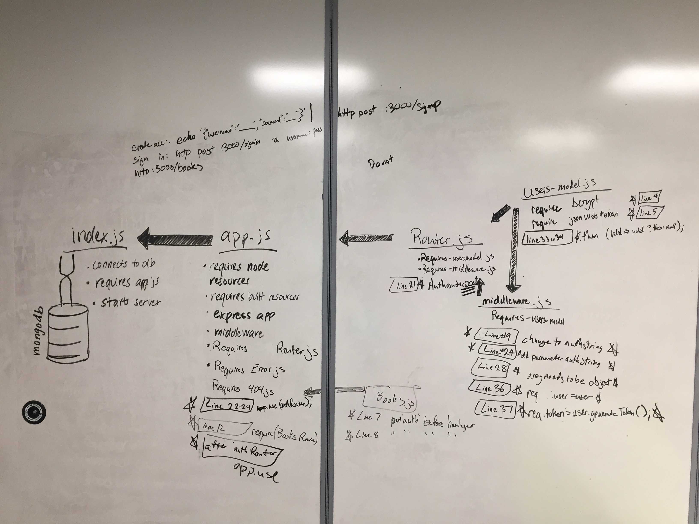

# lab-11
# lab11 LAB
=================================================

## Authentication

### Author: Vanessa 
### Collaberators: Jon Gentry, Greg Dukes, Cory Henderson, Alex White , Aaron Ferris

### Links and Resources
* [Pull Request to Master](https://github.com/codefellows-js-401d29-aaron-ferris/lab11/pull/1)
* [travis](https://travis-ci.com/codefellows-js-401d29-aaron-ferris/lab11)
* [heroku deployment] didn't work

#### Documentation
* [jsdoc](http://xyz.com)

### Modules Modifications
#### index.js
* starts application on port
* connects to mongo database

#### app.js
* imports important 3rd party resources for server
* initiates files
* exports the start function
#### router.js
*  holds the process signing in
*  holds the process signing up
* exports these methods as authrouter
#### users-model.js
* defines the shape of the user class
* includes a save function
* hashes password
* compares the password
* generates a token from the id and secret
#### middleware.js
* changes what is input from the command line into an object to compare
* uses user model to authenticate the user

#### books.js
* handles the books routes

#### 404.js
* handles the incorrect route error

#### error.js
* handles the 

### Modules Modifications
#### `app.js`
* 24: app.use('*', notFound);
* 27: app.use(authRouter);
* 12: const books = require('./routes/books.js');
* 29: app.use('/',books);

#### `router.js`
* 23: authRouter.post('/signin', auth, (req, res, next)

#### `users-model.js`
* const bcrypt = require('bcrypt');
* const jwt = require('jsonwebtoken');
* 33: .then(valid => valid ? this : null);

#### `middleware.js`
* function _authBasic(authString);
* 28: let authObject = {username,password}; 
* 36,37: req.user = user;
      req.token = user.generateToken();

### Setup
#### `.env` requirements
* From starter code, in your filepath base run `npm i`
* Create a .env file with the following lines
  * PORT=3000
  * MONGODB_URI=mongodb://localhost:27017/books
* To test locally do each in separate node filepaths
  * run `mongod` 
  * run `nodemon`
  * in the node commands:
    * to create account `echo'{"username":"Vanessa","password":"hello"}' | http post 3000/signup`
    * to sign in `http post :3000/signin -a Vanessa:hello`
    * `http:3000/books`

#### Running the app
* `nodemon`

#### Tests
* `npm test`

#### UML
